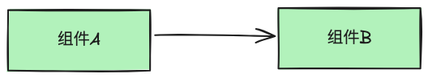

### 项目介绍

`LowCode` 是一个无代码通过拖拽的方式搭建系统。支持自定义渲染器和搭建器实现不同业务场景的搭建系统。

### 项目结构

```
LowCode
├── packages/
│ ├── builder/
│ │ ├── canvas 画布
│ │ ├── materials 物料区
│ │ ├── settings 编辑区
│ │ └── menu 菜单栏
│ ├── render 渲染器
│ ├── materials 物料库
│ ├── components 组件库
│ └── share 公共模块
└── app 启动项目

```

### 模块介绍

- components: 组件库是物料库的核心组成部分，包含所有组件。
- materials: 物料库是搭建器和渲染器的基本组成单元，是页面的原料，包含组件、编辑器、Icon。
- builder: 搭建器提供拖拽生成 schema 的能力。
- render: 渲染器通过消费 schema 生成页面。

### 架构图

系统架构如下：


- 组件库可以引入不同业务场景的组件库。
- 物料库基于组件生成物料，基于不同的业务场景定制不同的物料库。
- 基于注册的物料生成定制化的搭建器，搭建符合不同业务场景的页面。
- 基于注册的物料生成定制化的渲染器，渲染不同业务场景的页面。

系统搭建流程如下：


1. 注册不同物料，生成定制化搭建器，渲染器
2. 在搭建器中搭建和编辑页面，生成 schema
3. 渲染器根据 schema 渲染出页面

### 组件联动

1. 主动模式

在 A 组件的编辑器中设置需要联动的 B 组件的事件，当 A 组件点击时会触发 B 组件的事件



- 优点：

  - 控制明确：每个组件明确知道什么时候以及为什么会更新其他组件。

- 缺点：

  - 耦合性高：组件之间需要明确的通讯机制，增加了系统的复杂性和耦合性。
  - 维护困难：随着组件数量的增加，管理这些主动通知变得更加复杂。

2. 被动模式

通过一个 store 管理所有组件的状态，在 A 组件点击时更新 store 中 B 组件的状态，B 组件状态的变化会通知 B 组件事件的触发


- 优点：

  - 松耦合：组件之间不直接通讯，依赖共享状态或事件驱动，减少了耦合度。
  - 维护方便：随着系统的扩展，维护变得更加简单和直观。

- 缺点：

  - 复杂度增加：引入全局状态管理工具或事件驱动机制，增加了系统的复杂度。

为了维护后续复杂的组件之间的依赖关系，这里选择被动模式，将所有被依赖组件的状态维护在一个 store 中，通过 store 影响组件的变化。


- 配置阶段

  1. 在 A 组件的设置器中，关联需要联动的 B 组件
  2. 在 schema 中的组件 A 的信息中添加联动的 B 组件

- 运行阶段

  1. 触发 A 组件的事件
  2. 在 store 中生成 B 组件会被影响的状态
  3. store 中 B 组件的状态会影响 B 组件的更新
